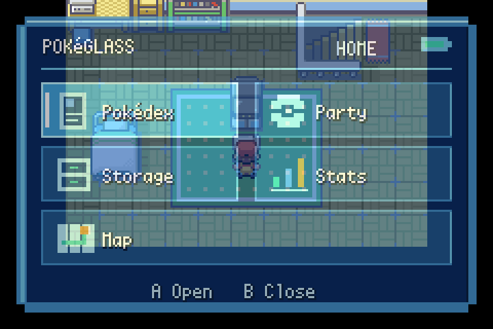

# PokéGlass QA — QOL, 2026-10-10

## Latest follow-up: glass launcher and app returns

The hub now uses a translucent inset tablet with five icon tiles, selection
highlights, a header, and button hints. BG0 alpha blending shows the player and
overworld through the glass. Closing the hub restores the field palette and
window/blending registers. Cursor changes redraw only the affected tiles to
avoid dropping short button presses during a full-screen redraw.

Pokédex, Party, Stats, and Map now resume the tablet script on exit, matching
Storage. The selected app remains highlighted on return. Nested screens still
step back through their own parent screen. The normal Pokédex entry point keeps
its original exit callback. The ownership gate from Oak's gift remains intact.

Validation on the rebuilt ROM:

- `make -j2` and `git diff --check` passed.
- mGBA fixture: six Pokémon, Pokédex enabled, tablet in Key Items.
- Each of the five apps opened; exiting each returned to the live hub task.
- Stats Summary returned through the picker to the hub.
- Screenshots confirmed transparency, the player behind the hub, and a clean
  field screen after closing it.
- Direction changes followed by short A presses worked after redraw optimization.
- Ten consecutive hub open/close cycles passed.

ROM SHA-256: `5f75fc56a78a8d8b21b9d20137ac53dbcf8da31059f0c4bdb8dd52695995d152`.
These were controlled UI tests, not a full playthrough. Fly travel, weather and
Flash-map combinations, and multiplayer remain untested. No commit or push was
performed for these changes.

## Follow-up: unlock only after Oak's tablet gift

The normal, debug, and Safari Start menus now require ownership of
`ITEM_POKEGLASS`. Starter and Pokédex flags alone do not unlock the hub.
This supersedes the earlier starter-flag unlock described below.

The updated ROM built successfully with `make -j2` after sourcing the local
`build-env.sh`; `git diff --check` passed.
ROM SHA-256: `c00fac191f84f91d577b41d387f5fe35095a0506d32e299cdd5264edd3269aee`.

Focused mGBA checks used a disposable field fixture and assertions against the
live Start-menu entries:

- Fresh game without the tablet: hidden.
- Starter flag set without the tablet: hidden.
- Pokédex flag also set without the tablet: hidden.
- Exact compiled `giveitem_msg` sequence from Oak's scene executed: item present
  in the bag, gift message displayed, and PokéGlass visible in Start.
- Selecting PokéGlass after the gift: five-app hub displayed.
- Removing the tablet in the fixture: hidden again despite the story flags.

The gift bytecode was matched uniquely in the ROM and executed in a controlled
field fixture. This verifies the gift routine and menu gate, not the full Oak
cutscene or a complete progression playthrough. No commit or push was performed
for this follow-up.

## Build and test method

Full ROM build passed with the existing ARM GCC 13.2.1 toolchain (`make -j2`).
ROM SHA-256: `05512513a1f27f3432b7eb6c0209730798d5a578e4114a2cb0a89d7f4ceeba29`.
`git diff --check` passed.

The previous unresolved-symbol errors were caused by zero-byte cached object
files for item_use, debug, and battle_tower. Rebuilding the empty objects resolved
them; they were not missing source implementations.

Runtime checks used mGBA 0.10.2 through its libretro core, real input events, and
framebuffer screenshots. A fresh game was started on the compiled QOL ROM.
A temporary emulator-RAM script enabled the Pokédex and created six level-25
Pokémon (Bulbasaur, Charmander, Squirtle, Pikachu, Eevee, Snorlax). This was a
controlled UI fixture, not a normal progression playthrough or a source change.
The one-member-party check removed five members in emulator RAM only.

## Reproduced issues and fixes

- Start-menu entry freed overworld buffers while continuing a field script:
  retain them during the tablet animation/hub and release them when entering an app.
- Full-screen window art overwrote menu/frame graphics; a later tile allocation
  also collided with field map screen blocks: use a small shared nine-tile bezel
  with separate safe tile ranges for field and party screens.
- Standard menu border transparency exposed pieces of the overworld through the
  opaque tablet: use a solid rectangular app list within the tablet bezel.
- Intro sprite declared 8bpp while its generated art was 4bpp: corrected OAM format.
- Legacy wide party card art was clipped, with HP labels overlapping names:
  draw complete compact cards, keep names, levels, gender and HP bars, and use
  the shared opaque tablet background. Full numeric HP remains in Summary.
- Stats opened with the Info background and broken subsequent page flips:
  initialize layer priorities, horizontal offset and page-flip parity for Skills.
- Returning from Stats opened the ordinary action submenu: return to its picker.
- Map incorrectly used the party Fly entry and cancellation path: browse the
  normal route map when Fly is unavailable; use the existing Fly unlock, map
  eligibility and a non-Egg party Fly user when available, with its own exit callback.
- Removing the separate Pokémon item would hide party access before receiving
  the Pokédex: expose PokéGlass after obtaining Pokémon as well.

## Checks completed on the final ROM

- Start menu: PokéGlass present; separate Pokémon entry absent in normal field context.
- Tablet intro and opaque five-app hub: screenshot review.
- Six-member party: both columns, selection highlight, Summary entry and exit.
- Party reordering: Pikachu and Bulbasaur exchanged columns/party positions successfully.
- One-member party: empty cards, directional navigation and cancellation.
- Stats: direct Skills entry; A cycles IV judgments and EV values; moves-page
  navigation and return render correctly; B returns to the picker.
- Pokédex: six species listed as seen/owned; exit returns to Start.
- Storage: menu and Move Pokémon box interface open; exit returns to the tablet hub.
- Map: normal region-map browsing and cancellation to Start.
- Ten consecutive hub open/close cycles: no visible corruption or hang.

## Limits and remaining design work

These checks do not establish a bug-free ROM. Fly travel, storage deposit/withdraw
transactions, long-session stability, save compatibility, multiplayer contexts,
and a full game playthrough were not validated. Eggs have a defensive Info-page
fallback but were not exercised in this fixture.

The tablet hub and party picker share the bezel. Pokédex, storage, region map and
Summary retain their existing screen designs. Most app exits return to Start;
storage returns to the tablet hub. A unified return-to-tablet flow and tablet
styling for every app would require further work if desired.

No commit or push was performed during this QA pass.
